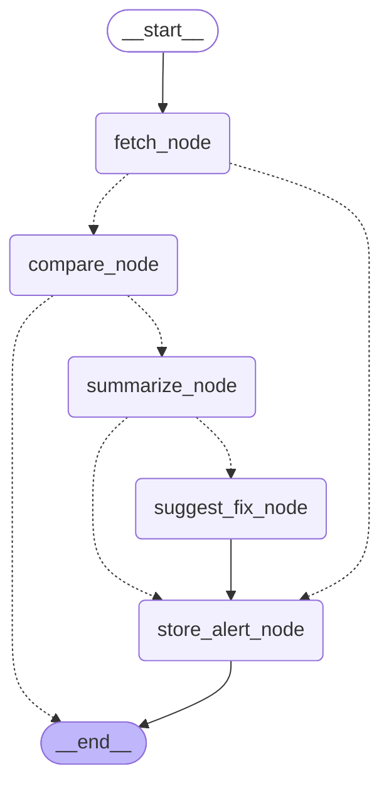

# API Integration Monitor

A backend service that actively monitors third-party API documentation for breaking and non-breaking changes.

## 🚀 Current Status: Core Engine

The entire backend pipeline for monitoring, detecting, classifying, and storing API changes is functional.

### What is Completed:
- **FastAPI + PostgreSQL** backend with SQLAlchemy ORM.
- **RESTful Endpoints**: Full CRUD endpoints for managing Monitored APIs and reading Alerts.
- **Scheduling**: Scheduling is implemented via a secret-protected `POST /internal/run-checks` endpoint (`X-Scheduler-Secret` header), designed to be called by an external scheduler. Automatic daily triggering via GitHub Actions cron is intentionally not yet enabled (only manual `workflow_dispatch` works for now).

---

## ⚙️ Architecture: LangGraph Pipeline

The system's core orchestration has been retrofitted to use [LangGraph](https://langchain-ai.github.io/langgraph/), replacing the previous imperative pipeline. The AI logic lives in the `app/agent/` package, structured as a 5-node `StateGraph`:



### Pipeline Details:
1. **`fetch_node`**: Uses [Tavily](https://tavily.com/) (extract) to fetch the latest documentation content and strip navigation boilerplate.
2. **`compare_node`**: Compares the newly fetched documentation against the stored baseline to detect if a change occurred.
3. **`summarize_node`**: If a change is detected, computes a diff, runs a Tavily search (distinct from the extract call in fetch_node) for outside context like changelogs or migration guides, then uses `ChatGroq` (with `.with_structured_output()`) to classify the change as `breaking` or `non-breaking` and summarize the impact.
4. **`suggest_fix_node`**: Uses another `ChatGroq` call to propose actionable fixes or migration steps based on the summary.
5. **`store_alert_node`**: Saves the generated `Alert` to the Postgres database.

**Conditional Routing**: The graph uses conditional routing based on `status` and `severity`. Errors bypass processing and skip straight to alert storage. If there's no change or a new baseline is being established, it skips to the end with no alert generated.

---

## 🛠 Setup & Local Development

### 1. Environment
Copy `.env.example` to `.env` and fill in your keys:
```bash
cp .env.example .env
```
You will need:
- A local PostgreSQL database (`DATABASE_URL`)
- A [Tavily API Key](https://tavily.com/) (`TAVILY_API_KEY`)
- A [Groq API Key](https://console.groq.com/keys) (`GROQ_API_KEY`)
- A generated `SCHEDULER_SECRET` (Run: `python -c "import secrets; print(secrets.token_urlsafe(32))"`)

**Optional: LangSmith Tracing**
The app runs fine without tracing (with `LANGSMITH_TRACING=false` or unset), but you can enable LangSmith to trace the LangGraph pipeline execution:
- `LANGSMITH_TRACING=true`
- `LANGSMITH_API_KEY=your-langsmith-api-key`
- `LANGSMITH_PROJECT=api-integration-monitor-agent`
- `LANGSMITH_ENDPOINT=https://api.smith.langchain.com`

### 2. Install Dependencies
Make sure you are in your virtual environment, then run:
```bash
pip install -r requirements.txt
```

### 3. Run the Server
```bash
uvicorn main:app --reload
```
- **Docs (Swagger)**: http://localhost:8000/docs
- **ReDoc**: http://localhost:8000/redoc

### 4. Trigger a Manual Check
You can trigger the batch check locally by passing your secret:
```bash
curl -X POST http://localhost:8000/internal/run-checks \
  -H "X-Scheduler-Secret: your_long_random_secret_here"
```
